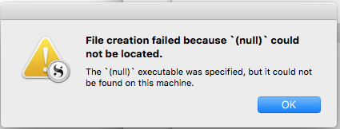

# Post-Processing Built In #

Well, as predicted, I worked on plugging my splitter script into the Processing tab in my layout. What I wound up with was this:

![][ScreenShot2018-06-19at80328PM]

You turn on the Post-process checkbox, then put the full path to the script in the Path field. I added the output redirect to test.txt as a check to see whether the build did the right thing. There’s surely a way to redirect STEDRR also but I didn’t look it up. Turns out if the script explodes. Scrivener detects that and pops up a window giving you the error.

And it did that, in two different ways. First, if you don’t get the path to the program right, you get a very obscure message:



That wasn’t helpful, and I’ll be filing a bug report on it. But it was clear enough that it wasn’t finding my file, so I fiddled the address until it did.

The second message was an error message from inside the script, saying that the split operation had found illegal characters in the file. Since Scrivener displays the actual error message, you know where to look. But it turned out that if I executed the command manually, it worked, and when Scrivener executed it, it didn’t. That was confusing.

The message gave a small clue, saying that `split` had encountered a character that was illegal in US-ASCII. Now, I’m not clever enough to know that Ruby runs in UTF-8, and I still don’t know how UTF-8 characters got into the file but probably it’s something I typed. 

I thought at first that maybe Scrivener didn’t pass the output file name in, though the documentation said so. So I added a print statement to print the parameter. It was pages.md, as it should be. I wasn’t sure I had the right file, so I printed the length of the string read in.

Lo! and Behold! the length varied between when I ran it by hand and when Scrivener ran it. I searched for the error message using Google (always do that when confused) and I found something that referred to the file encoding. 

I printed the encoding when I ran it and when Scrivener ran it, and sure enough it was different. So I added one line:

`ARGF.set_encoding(Encoding::UTF_8)`

And it all began to work perfectly! Whew!

I renamed the folder where the real Pages live to end in `_mmd`, so that Scrivener would built the files correctly. I compiled directly to the real Pages folder, the script ran.

I did the usual

```
git status
git add -A
git commit -m “autogenerate works!”
git push
```

And the booklet showed up just as it should. I’ll do that right now, and you can read this Section. 

See you again soon!


[Creating the ToC](18.html) | [Top](index.html) | [Assessing Where We Are](20.html)


[ScreenShot2018-06-17at54341AM]: ScreenShot2018-06-17at54341AM.png

[ScreenShot2018-06-15at34845AM]: ScreenShot2018-06-15at34845AM.png

[ScreenShot2018-06-15at35655AM]: ScreenShot2018-06-15at35655AM.png

[ScreenShot2018-06-15at35933AM]: ScreenShot2018-06-15at35933AM.png

[ScreenShot2018-06-15at41513AM]: ScreenShot2018-06-15at41513AM.png

[ScreenShot2018-06-15at43151AM]: ScreenShot2018-06-15at43151AM.png

[ScreenShot2018-06-15at43300AM]: ScreenShot2018-06-15at43300AM.png

[ScreenShot2018-06-15at43419AM]: ScreenShot2018-06-15at43419AM.png

[ScreenShot2018-06-15at43550AM]: ScreenShot2018-06-15at43550AM.png

[ScreenShot2018-06-15at45351AM]: ScreenShot2018-06-15at45351AM.png

[ScreenShot2018-06-15at45543AM]: ScreenShot2018-06-15at45543AM.png

[ScreenShot2018-06-15at50722AM]: ScreenShot2018-06-15at50722AM.png

[ScreenShot2018-06-15at51250AM]: ScreenShot2018-06-15at51250AM.png

[ScreenShot2018-06-15at51454AM]: ScreenShot2018-06-15at51454AM.png

[ScreenShot2018-06-15at92421AM]: ScreenShot2018-06-15at92421AM.png

[ScreenShot2018-06-15at95953AM]: ScreenShot2018-06-15at95953AM.png

[ScreenShot2018-06-16at74710AM]: ScreenShot2018-06-16at74710AM.png

[ScreenShot2018-06-17at64119AM]: ScreenShot2018-06-17at64119AM.png

[ScreenShot2018-06-17at70530AM]: ScreenShot2018-06-17at70530AM.png

[ScreenShot2018-06-17at81328PM]: ScreenShot2018-06-17at81328PM.png

[ScreenShot2018-06-18at94526AM]: ScreenShot2018-06-18at94526AM.png

[ScreenShot2018-06-19at80328PM]: ScreenShot2018-06-19at80328PM.png

[ScreenShot2018-06-22at101952AM]: ScreenShot2018-06-22at101952AM.png

[ScreenShot2018-06-22at102316AM]: ScreenShot2018-06-22at102316AM.png

[ScreenShot2018-06-22at103031AM]: ScreenShot2018-06-22at103031AM.png

[ScreenShot2018-06-22at103054AM]: ScreenShot2018-06-22at103054AM.png

[ScreenShot2018-06-22at103500AM]: ScreenShot2018-06-22at103500AM.png

[ScreenShot2018-06-22at104957AM]: ScreenShot2018-06-22at104957AM.png

[ScreenShot2018-06-22at110544AM]: ScreenShot2018-06-22at110544AM.png

[ScreenShot2018-06-23at52634AM]: ScreenShot2018-06-23at52634AM.png

[ScreenShot2018-06-24at92104PM]: ScreenShot2018-06-24at92104PM.png

[ScreenShot2018-06-24at92825PM]: ScreenShot2018-06-24at92825PM.png

[ScreenShot2018-06-24at92908PM]: ScreenShot2018-06-24at92908PM.png

[ScreenShot2018-06-26at102912AM]: ScreenShot2018-06-26at102912AM.png

[ScreenShot2018-06-17at60628AM]: ScreenShot2018-06-17at60628AM.png

