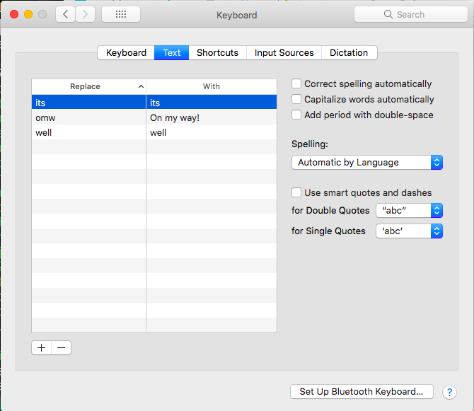
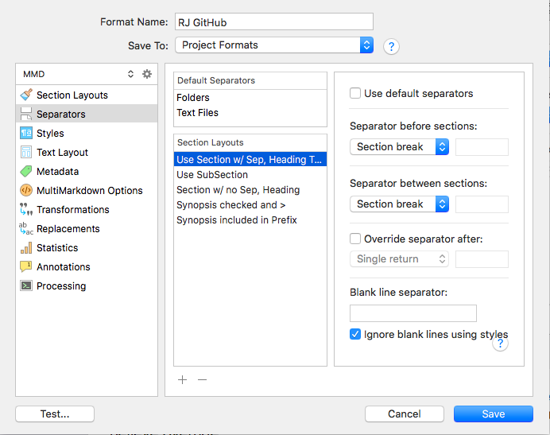
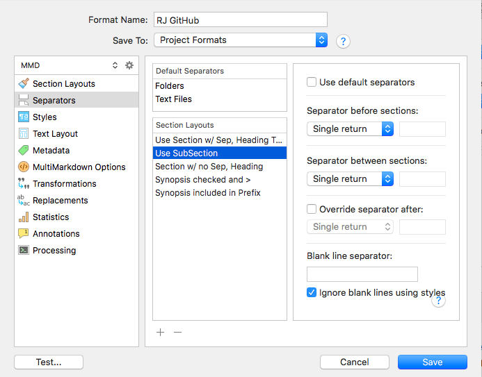

[Assessing Where We Are](20.html) | [Top](index.html) | [Thoughts on Improvements](22.html)

# TL; DR #  

For those who don’t want to follow along all my missteps and wander down the dead ends of my learning, let me sum up here how my Scrivener is set up.  

### System Preferences 



As you see here, I have most everything turned off. Most of that is just personal preference, though smart quotes may have caused me a little trouble in the transition from Scrivener to markdown to GitHub. 

I’ve also adjusted my preference for date formatting, because I’m using Scrivener’s placeholders for date and time up at the top of this booklet.

I think that’s all that I’ve touched.  

### Scrivener Preferences

In Scrivener preferences, if I don’t mention it here, I have left it alone (or believe that I have).

### General

Under Saving, I have auto-save after 2 seconds. I didn’t have “Take snapshots”, but just checked it now, because why not.

I have no shared templates but that may change when I actually use this setup for something.

I have Automatic Quit set to 10 minutes, because I use Scrivener on both laptop and home machine, and the quit gives me a better chance of not having it open on the other computer. No good can come of having a project open on two computers, although Scrivener seems to handle it pretty well.

### Editing

Default text zoom: 150 because I have tiny little eyes.

### Behaviors

Double-Clicking is enabled, so that I can double click in the cork board mode and create a new card. I noticed that I seemed to have the habit of trying that, so I enabled it.

### Appearance

Under Scrivenings, I have “Show title in Scrivenings” enabled. I don’t use the Scrivenings mode often but when I do I prefer to see the titles.

### Corrections

I don’t think any of these are changed, but …

* Auto-Correction: Capitalize “i”, superscript ordinals, symbol and text substitutions
* Punctuation: Disable smart dashes
* Data-Detection: Automatically detect web addresses
* Auto-completion: all items checked

### Sharing

No changes, I think …

### Backup

Turn on auto backups, project close, before synching, compress, keep 5.  

### Compile Format

Here’s where the metaphorical rubber meets the virtual road. I’ve created a custom compile format, and it’s full of changes.

When I start a compile, it looks like this:

![][ScreenShot2018-06-22at101952AM]

My special compile format is RJ GitHub, and the section types shown on the right are my special ones, *Section* and *Sub-Section*. We’ll come to those in a bit. There’s nothing special in the tags and replacement buttons at top right, but in the Settings (gear) I have some important items turned off:


![][ScreenShot2018-06-22at102316AM]

In particular, I wanted “Convert rich text to MultiMarkdown” turned off. The reason is that I type Markdown pound signs and other forms directly, and this check box escapes those, defeating my purpose. If you set up all the right rich text styles, you might want to go the other way. For now, I’m sticking with old school.  

Double-clicking my format, we can start looking at the details:

### Section Layouts

![][ScreenShot2018-06-22at103031AM]
![][ScreenShot2018-06-22at103054AM]

In section layouts there’s really nothing special on the initial page, and none of the other tabs have anything changed in them.

![][ScreenShot2018-06-22at103500AM]

I have it adding closing hashes to titles, which is, I believe, the default.

### Separators

I’ve overridden the default separators on Folders and Text Files in my layouts. The ones I actually use are called “Use” this and that:



It turns out that these settings are important. Section break, in the top one, inserts the default page separator, four dashes, that my splitter script searches for. It would be possible to put in a more unique separator, as AmberV’s example, referenced elsewhere, does. 

The three other sections are experimental and I won’t trouble you with them.

### Text Layout

![][ScreenShot2018-06-22at104957AM]

This one puts a separator at the end of the document, namely ahead of the magic references links that my splitter script looks for. If I didn’t include this, it would be difficult for splitter to find and break off the references, which we insert into every page we split out.

### Processing

![][ScreenShot2018-06-22at110544AM]

Here’s where we put the link to our Ruby splitter script, which divides up Scrivener’s big output file into the smaller files we want for GitHub pages. The path has to be a legitimate path to the file. The operating system $PATH or equivalent variables are not interrogated. 

The arguments will automatically include the name of the output file, and the script will be running in the Scrivener output folder. The `> test.txt` is there so that I can see what happened during the run of splitter. Generally I don’t look.

  

### Layout Assignments

We assign a section layout to each section type in Scrivener. There’s a button at the bottom of the middle section of the compile panel that says “Assign Section Layouts” and, well, that’s what it does. It opens another panel looking like this:

![][ScreenShot2018-06-23at52634AM]

I have “Section” assigned to “Use Section w/ Sep, Heading Text, and “Sub-Section” is assigned to “Use SubSection”. (I often name things that are intended to be “used” with the word “Use” in their name, as a reminder.)

I believe that if I were to assign “As-Is” to “Sub-Section” it would probably also work, but “Use SubSection” is what I’m using and I’m sticking to it.  

### Forum Links

Here are links to entries on the excellent Scrivener forum, addressing some of the issues I’ve had, including most of those mentioned here:

* [Trailing Spaces in Title Header on Folders Only](https://www.literatureandlatte.com/web/forum/viewtopic.php?f=2&t=52556)
* [Creating a GitHub Pages "booklet" using Scrivener](https://www.literatureandlatte.com/web/forum/viewtopic.php?f=19&t=52509)
* [Compiling To LaTeX -- One file per section?](https://www.literatureandlatte.com/web/forum/viewtopic.php?f=2&t=52114)
* [Can MMD compile folder and file name extension differ? Or even the names?](https://www.literatureandlatte.com/web/forum/viewtopic.php?f=2&t=52488)
* [Compiling vanilla MMD, can't get rid of title?](https://www.literatureandlatte.com/web/forum/viewtopic.php?f=2&t=52451)

There are other topics I’ve created or spoken to. You can search the forum for my name to find them, but the above are the ones that seem to me to be of the most potential interest.  

### Splitter

Here’s a current copy of splitter, the one used to publish this version:

```ruby
#!/usr/bin/ruby
require 'tempfile'

SPLIT_MARKER = "----\n\n"
TOC_MARKER = "<!--TOC-->\n"
Titles = {}

def add_toc(chunk)
  halves = chunk.split(TOC_MARKER)
  puts "halves length %d" % halves.length
  return chunk if halves.length != 2
  return halves[0] + table_of_contents + halves[1]
end

def make_file_name(filenumber)
  return "index.md" if filenumber == 0
  return sprintf("%02d.md", filenumber)
end

def make_link_line(filenumber, max_length)
  link = ""
  link += "[%s](%02d.html) | " % [Titles[filenumber - 1], filenumber - 1] unless filenumber == 0
  link += "[Top](index.html) | "
  link += "[%s](%02d.html)" % [Titles[filenumber + 1], filenumber + 1] unless filenumber >= max_length
  return link
end

def record_titles(chunks)
  filenumber = 0
  chunks.each do | chunk |
    title = chunk.split("\n")[0]
    Titles[filenumber] = title.strip[2..-3]
    filenumber += 1
  end
end

def table_of_contents
  toc = ""
  Titles.each_pair do | number, title |
    # toc += "* [" + title + "](" + make_file_name(number) + ")\n" 
    toc += "* [%s](%s)\n" % [title, make_file_name(number)] 
  end
  return toc
end

def update_table_of_contents(chunks)
  toc_chunk = chunks.delete_at(0)
  updated_toc = add_toc(toc_chunk)
  chunks.insert(0, updated_toc)
end

def write_file(chunk, reference_chunk, filenumber, max_length)
  filename = make_file_name(filenumber)
  title = Titles[filenumber]
  puts filename + ": " + title
  tf = File.new(filename, "w")
  tf.print chunk
  tf.puts
  tf.puts
  tf.puts make_link_line(filenumber, max_length)
  tf.puts
  tf.puts
  tf.print reference_chunk
  tf.puts
  tf.puts
  tf.close
end

def write_files(chunks, reference_chunk)
  filenumber = 0
  chunks.each do |chunk|
    write_file(chunk, reference_chunk, filenumber, chunks.length - 1) unless chunk.length < 1
    filenumber += 1
  end
end

ARGF.set_encoding(Encoding::UTF_8) 
input = ARGF.read
chunks = input.split(SPLIT_MARKER)
reference_chunk = chunks.delete_at(-1)
record_titles(chunks)
update_table_of_contents(chunks)
write_files(chunks, reference_chunk)
```


[Assessing Where We Are](20.html) | [Top](index.html) | [Thoughts on Improvements](22.html)


[ScreenShot2018-06-17at54341AM]: ScreenShot2018-06-17at54341AM.png

[ScreenShot2018-06-15at34845AM]: ScreenShot2018-06-15at34845AM.png

[ScreenShot2018-06-15at35655AM]: ScreenShot2018-06-15at35655AM.png

[ScreenShot2018-06-15at35933AM]: ScreenShot2018-06-15at35933AM.png

[ScreenShot2018-06-15at41513AM]: ScreenShot2018-06-15at41513AM.png

[ScreenShot2018-06-15at43151AM]: ScreenShot2018-06-15at43151AM.png

[ScreenShot2018-06-15at43300AM]: ScreenShot2018-06-15at43300AM.png

[ScreenShot2018-06-15at43419AM]: ScreenShot2018-06-15at43419AM.png

[ScreenShot2018-06-15at43550AM]: ScreenShot2018-06-15at43550AM.png

[ScreenShot2018-06-15at45351AM]: ScreenShot2018-06-15at45351AM.png

[ScreenShot2018-06-15at45543AM]: ScreenShot2018-06-15at45543AM.png

[ScreenShot2018-06-15at50722AM]: ScreenShot2018-06-15at50722AM.png

[ScreenShot2018-06-15at51250AM]: ScreenShot2018-06-15at51250AM.png

[ScreenShot2018-06-15at51454AM]: ScreenShot2018-06-15at51454AM.png

[ScreenShot2018-06-15at92421AM]: ScreenShot2018-06-15at92421AM.png

[ScreenShot2018-06-15at95953AM]: ScreenShot2018-06-15at95953AM.png

[ScreenShot2018-06-16at74710AM]: ScreenShot2018-06-16at74710AM.png

[ScreenShot2018-06-17at64119AM]: ScreenShot2018-06-17at64119AM.png

[ScreenShot2018-06-17at70530AM]: ScreenShot2018-06-17at70530AM.png

[ScreenShot2018-06-17at81328PM]: ScreenShot2018-06-17at81328PM.png

[ScreenShot2018-06-18at94526AM]: ScreenShot2018-06-18at94526AM.png

[ScreenShot2018-06-19at80328PM]: ScreenShot2018-06-19at80328PM.png

[ScreenShot2018-06-22at101952AM]: ScreenShot2018-06-22at101952AM.png

[ScreenShot2018-06-22at102316AM]: ScreenShot2018-06-22at102316AM.png

[ScreenShot2018-06-22at103031AM]: ScreenShot2018-06-22at103031AM.png

[ScreenShot2018-06-22at103054AM]: ScreenShot2018-06-22at103054AM.png

[ScreenShot2018-06-22at103500AM]: ScreenShot2018-06-22at103500AM.png

[ScreenShot2018-06-22at104957AM]: ScreenShot2018-06-22at104957AM.png

[ScreenShot2018-06-22at110544AM]: ScreenShot2018-06-22at110544AM.png

[ScreenShot2018-06-23at52634AM]: ScreenShot2018-06-23at52634AM.png

[ScreenShot2018-06-24at92104PM]: ScreenShot2018-06-24at92104PM.png

[ScreenShot2018-06-24at92825PM]: ScreenShot2018-06-24at92825PM.png

[ScreenShot2018-06-24at92908PM]: ScreenShot2018-06-24at92908PM.png

[ScreenShot2018-06-26at102912AM]: ScreenShot2018-06-26at102912AM.png

[ScreenShot2018-06-17at60628AM]: ScreenShot2018-06-17at60628AM.png

