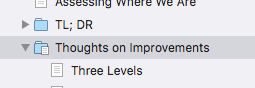

# Thoughts on Improvements #

Just as an experiment, I’ve put some text inside the folder that defines this section of thoughts. I did it by typing in the Scrivenings mode, though there are other ways of doing it, I’m sure. I expect that it’ll compile just fine and this will show up as an introductory paragraph in this (big) section.

In the binder, the folder icon is now showing a little text indicator so that I can be aware there’s text in here.

  

### Three or More Levels

I suspect when I next use Scrivener in earnest, I’ll go to three levels instead of the current two. I’ll have something like Section, Chapter, and Paragraphs. I don’t know, I’ll need better names but the idea will be to allow for major sections with identifiable formatting.

Sometimes in fiction chapters (especially), there’s another breakdown, often indicated by a little graphical widget in the text. If I wanted that I’m not sure if I’d do it with an additional level, or perhaps just a new layout. I just have an inkling that there’ll be more to do.

In fact, I’m typing in titles like the one above, which is a pretty clear indication that I have in mind more structure than is presently defined in my format and layouts.  

### Auto Titles in Subs

Relatedly, I’m typing titles fairly often in some of these parts of the project that are in folders. Since I include titles automatically in my top level layout, and since I’m using them often in the lower level, this, too is evidence that I need a deeper structure, and perhaps automatic titles all the way down, or most of the way down.

I’ll evolve that as I go on with other writings.  

### Styles

Scrivener does allow you to use paragraph and font styles in your editor view, and has the ability to compile different output based on style. So in principle, at least, I could *italicize* the word “italicize” in my style, and have it compiled as \*italicize\*, so that it would show up in italics. 

I’m used to typing in plain text, and will probably stick with it, and I believe it might be difficult to set up otherwise. When I’ve set the mode in Scrivener that does that, it also escapes all my own markup, so I think I’d have to convert all the way. 

Possibly, there’s another way to do it, by associating a compiled form with any styling I used. That would take experimentation, and since I’m comfortable writing my own markup, I’ll probably keep doing it that way.

You might wish to go another way.

[TL; DR](21.html) | [Top](index.html) | [Appendices and Ephemera](23.html)

[ScreenShot2018-06-17at54341AM]: ScreenShot2018-06-17at54341AM.png

[ScreenShot2018-06-15at34845AM]: ScreenShot2018-06-15at34845AM.png

[ScreenShot2018-06-15at35655AM]: ScreenShot2018-06-15at35655AM.png

[ScreenShot2018-06-15at35933AM]: ScreenShot2018-06-15at35933AM.png

[ScreenShot2018-06-15at41513AM]: ScreenShot2018-06-15at41513AM.png

[ScreenShot2018-06-15at43151AM]: ScreenShot2018-06-15at43151AM.png

[ScreenShot2018-06-15at43300AM]: ScreenShot2018-06-15at43300AM.png

[ScreenShot2018-06-15at43419AM]: ScreenShot2018-06-15at43419AM.png

[ScreenShot2018-06-15at43550AM]: ScreenShot2018-06-15at43550AM.png

[ScreenShot2018-06-15at45351AM]: ScreenShot2018-06-15at45351AM.png

[ScreenShot2018-06-15at45543AM]: ScreenShot2018-06-15at45543AM.png

[ScreenShot2018-06-15at50722AM]: ScreenShot2018-06-15at50722AM.png

[ScreenShot2018-06-15at51250AM]: ScreenShot2018-06-15at51250AM.png

[ScreenShot2018-06-15at51454AM]: ScreenShot2018-06-15at51454AM.png

[ScreenShot2018-06-15at92421AM]: ScreenShot2018-06-15at92421AM.png

[ScreenShot2018-06-15at95953AM]: ScreenShot2018-06-15at95953AM.png

[ScreenShot2018-06-16at74710AM]: ScreenShot2018-06-16at74710AM.png

[ScreenShot2018-06-17at64119AM]: ScreenShot2018-06-17at64119AM.png

[ScreenShot2018-06-17at70530AM]: ScreenShot2018-06-17at70530AM.png

[ScreenShot2018-06-17at81328PM]: ScreenShot2018-06-17at81328PM.png

[ScreenShot2018-06-18at94526AM]: ScreenShot2018-06-18at94526AM.png

[ScreenShot2018-06-19at80328PM]: ScreenShot2018-06-19at80328PM.png

[ScreenShot2018-06-22at101952AM]: ScreenShot2018-06-22at101952AM.png

[ScreenShot2018-06-22at102316AM]: ScreenShot2018-06-22at102316AM.png

[ScreenShot2018-06-22at103031AM]: ScreenShot2018-06-22at103031AM.png

[ScreenShot2018-06-22at103054AM]: ScreenShot2018-06-22at103054AM.png

[ScreenShot2018-06-22at103500AM]: ScreenShot2018-06-22at103500AM.png

[ScreenShot2018-06-22at104957AM]: ScreenShot2018-06-22at104957AM.png

[ScreenShot2018-06-22at110544AM]: ScreenShot2018-06-22at110544AM.png

[ScreenShot2018-06-23at52634AM]: ScreenShot2018-06-23at52634AM.png

[ScreenShot2018-06-17at60628AM]: ScreenShot2018-06-17at60628AM.png

